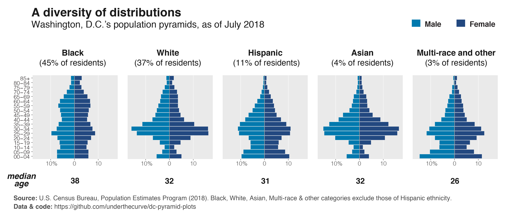

# Washington, D.C.'s population pyramids

[#plotswithchristine](https://twitter.com/search?f=tweets&vertical=default&q=%23plotswithchristine&src=typd)

## The data

**[`dc_2010_2018.csv`](https://github.com/underthecurve/dc-pyramid-plots/blob/master/dc_2010_2018.csv)**: D.C.'s 2010-2018 population by age, sex & race/ethnicity numbers, from the U.S. Census Bureau's 2018 [population estimates program](https://www.census.gov/data/tables/time-series/demo/popest/2010s-counties-detail.html). For details on the pre-processing, see [this repo](https://github.com/baltimore-sun-data/population-estimates-race-2018) by [The Baltimore Sun Data Desk](https://github.com/baltimore-sun-data).

**[`dc_age2018`](https://github.com/underthecurve/dc-pyramid-plots/blob/master/dc_age2018.csv)**: a slice of the above dataset that provides D.C.'s population by age and race for 2018.

## The code

**[`plot_code.R`](https://github.com/underthecurve/dc-pyramid-plots/blob/master/plot_code.R)**: R code to produce the population pyramids

**[`interpolate_medians.ipynb`](https://nbviewer.jupyter.org/github/underthecurve/dc-pyramid-plots/blob/master/interpolate_medians.ipynb)**: Python code (experimental) to interpolate the median age for the D.C. 2018 data from the grouped age categories for each race/ethnicity. The code for estimating the median from grouped data is from the [Los Angeles Times Data Desk](https://github.com/datadesk). For more information, see the [`census-data-aggregator`](https://github.com/datadesk/census-data-aggregator) repo by [@palewire](https://github.com/palewire).

## Licensing

All code in this repository is available under the MIT License. The data files are available under the Creative Commons Attribution 4.0 International (CC BY 4.0) license.